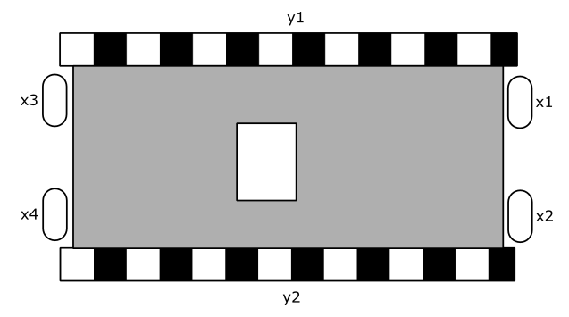

# Lab 1: Transistores / CI

Esse laboratório tem como objetivo trabalhar com os conceitos básicos de portas lógicas realizadas a base de transistores e também trabalhar com componentes integrados (CI).

Existem basicamente três níveis de simulação de componentes eletrônicos: a primeira, puramente lógica utiliza de portas lógicas "ideais" (https://simulator.io/board). Um simulador mais preciso irá utilizar transistores para a implementação dessas portas lógicas porém não leva em consideração todos os fatores físicos-eletrônicos dos componentes (http://falstad.com/circuit/). Já um simulador que leva em consideração as propriedades dos componentes é chamado de SPICE e irá gerar uma simulação mais precisa em termos físicos do circuito original (http://circuitlab.com).

!!! progress
    Cheguei Aqui!

Usaremos o carrinho da figura:

{width=400}

## Parte 1

Escolha um dos quatro bumpers do carrinho.

Monte um circuito em que um LED acenda caso o bumper seja apertado.

Para isso, o primeiro passo seria converter o aperto do botão em sinal elétrico. Podemos usar um resistor como pull-up ou pull-down, conforme mostrado na figura.

{width=400}

O passo seguinte seria implementar a lógica. Neste caso, utilize um resistor de pull-up e um inversor (CI CD 4007) para acionar o circuito.

O que ocorre se for usado um resistor de pull-down no mesmo circuito?

## Parte 2

Escolha dois dos quatro bumpers do carrinho.

Monte um circuito em que um LED acenda **SE E SOMENTE SE** os dois forem apertados simultaneamente.

Selecione o resistor de pull-up ou pull-down e monte a lógica adequada.

## Parte 3

Agora iremos usar os quatro bumpers do carrinho.

Monte um circuito com dois LEDs. O primeiro deve acender **SE E SOMENTE SE** todos os bumpers forem apertados simultaneamente. O segundo deve acender **SE E SOMENTE SE** nenhum bumper for apertado.

Selecione o resistor de pull-up ou pull-down e monte a lógica adequada.

!!! progress
    Cheguei Aqui!

## Praticando no papel

> Questão extraída do EXAME NACIONAL DE DESEMPENHO DOS ESTUDANTES 2014

Um processo monitora três parâmetros para controle de qualidade: `A`, `B`, `C`. Cada parâmetro possui um
valor na decisão final da qualidade. A existência do parâmetro `A` pesa 30% na decisão final, enquanto os
parâmetros `B` e `C` pesam 30% e 40%, respectivamente. O grau de aprovação do processo é dado pela soma
dos percentuais desses três parâmetros. O produto gerado pelo processo é considerado aprovado, caso o
grau de qualidade seja superior ou igual a 60%, e reprovado, se o grau de qualidade for inferior ou igual a
30%.

Caso o grau de qualidade esteja entre 30% e 60%, a decisão de aprovação ou reprovação é indiferente.
Por exemplo, se um produto apresentar os parâmetros `A` e `B`, terá grau de qualidade de 30%+30% = 60%,
levando à sua aprovação.

Com base na situação descrita, projete um circuito lógico com o menor número possível de portas lógicas,
para determinar a aprovação ou não do produto de acordo com a presença de seus parâmetros. As entradas
do circuito serão os sinais `A`, `B`,`C`, e a saída será um sinal `Z`. Para atingir esse objetivo, faça o que se pede nos itens a seguir.

1. Monte uma tabela verdade do sistema com a formação `A`, `B`, `C`. (valor: 4,0 pontos)
1. Desenhe o circuito final otimizado utilizando portas lógicas. (valor: 6,0 pontos)
1. *(extra, não tinha no enade)* Implemente a lógica encontrada com CIs da família 74xx
 

