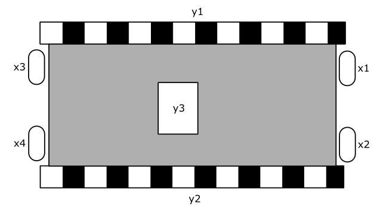
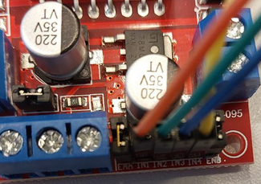

# A - Álgebra Booleana e Implementação de Funções Lógicas com CIs

| Data da entrega| 
|----------------|
| {{apsA_date}} |

Nesse projeto iremos utilizar a álgebra booleana para obter as funções lógicas de um sistema as quais deverão ser implementadas utilizando CIs.

Os arquivos relacionados a este projeto devem ser enviados pelo Blackboard (é necessário que apenas um(a) integrante do grupo envie, desde que identifique os demais membros).

Queremos controlar o robô da figura a seguir:

{width=400}

onde y1 e y2 são sinais de saída (de 2 bits cada) para os motores que controlam as esteiras da esquerda e direita. x1, x2, x3 e x4 são sensores (bumpers) para detectar a colisão do robô.

Os sinais de y1 e y2 (de 2 bits cada) descrevem os seguintes movimentos:

- "01" - motor ligado diretamente (andando para frente)
- "10" - motor ligado reversamente (andando para trás) 
- "00" - motor desligado

> **os sinais y1 e y2 devem ser ligados as entradas I1, I2, I3 e I4 da ponte H.**

{width=400}

## Controle

O controle do carrinho deve funcionar da seguinte forma:

1. Todos os motores desligados se (x1 ou x2) e (x3 ou x4) indicarem colisão.
2. Todos os motores ligados diretamente se nenhum sensor indicar colisão.
3. Ambos os motores ligados reversamente se os sensores (x1 e x2) detectarem colisão.
4. Ambos os motores ligados diretamente se os sensores (x3 e x4) detectarem colisão.
5. Motor esquerdo (y1) desligado e motor direito (y2) ligado reversamente quando x1 detectar colisão, mas não x2.
6. Motor esquerdo (y1) ligado reversamente e motor direito (y2) desligado quando x2 detectar colisão, mas não x1.
7. Motor esquerdo (y1) desligado e motor direito (y2) ligado diretamente quando x3 detectar colisão, mas não x4.
8. Motor esquerdo (y1) ligado diretamente e motor direito (y2) desligado quando x4 detectar colisão, mas não x3.

> Caso alguma condição lógica esteja presente em mais de uma instrução, considerar a primeira condição que ocorre!

## Rubricas de avaliação

| Conceito | Descritivo                                                  |
|----------|-------------------------------------------------------------|
| **I**    | **Funções Lógicas Não Obtidas:** O grupo não conseguiu derivar as funções lógicas necessárias para o controle do motor com base nos requisitos do projeto.|
|          |                                                                      |
| **D**    | **Obtenção sem Simplificação das Funções Lógicas:** As funções foram obtidas a partir dos requisitos do projeto, mas não foram simplificadas usando álgebra booleana.|   
|          | **Apresentação Pouco Clara das Funções Lógicas:** A apresentação das funções lógicas e sua relação com as condições do projeto pode estar confusa ou pouco clara, dificultando a compreensão.|  
|          |                                                                      |
| **C**    | **Obtenção, Simplificação e Aplicação das Funções Lógicas:** As funções lógicas foram obtidas corretamente a partir dos requisitos do projeto e simplificadas usando técnicas de álgebra booleana|   
|          | **Video demonstrando parte 1 do Lab 1**                              |  
|          |                                                                      |
| **B**    | **Implementação em Simulador das Funções Lógicas:** As funções lógicas foram derivadas dos requisitos do projeto e implementadas de forma precisa usando um simulador de circuitos, como o Falstad ou o Tinkercad|   
|          | **Vídeo ou Arquivo de Simulação Explicativo:**                            |  
|          | **Video demonstrando partes 2 e 3 do Lab 1**                              |  
|          |                                                                      |
| **A**    | **Implementação no Robô das Funções Lógicas:** As funções lógicas foram  implementadas com sucesso usando Circuitos Integrados (CIs) no protoboard|   
|          | **Vídeo de Demonstração Abrangente:**  grupo forneceu um vídeo detalhado que mostra a montagem dos CIs no protoboard, a conexão com os sensores, a interação das funções lógicas com os sinais dos sensores e como o robô respondeu a diferentes cenários.                           |  

### Entrega

Nesta APS (e apenas nesta) não haverá forms para preencher. A entrega será feita pelo Blackboard.

Apenas um aluno(a) deve enviar os arquivos/links. O(A) escolhido(a) para realizar o envio é o primeiro nome de cada grupo na [Tabela - Grupos]({{lab2_link}}).

